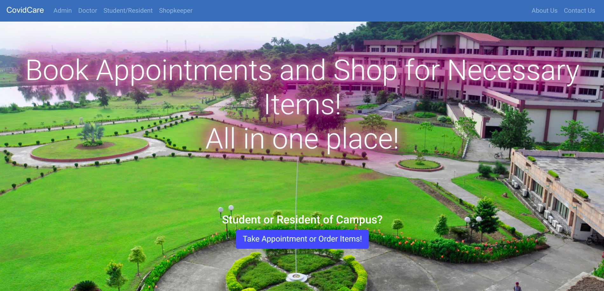
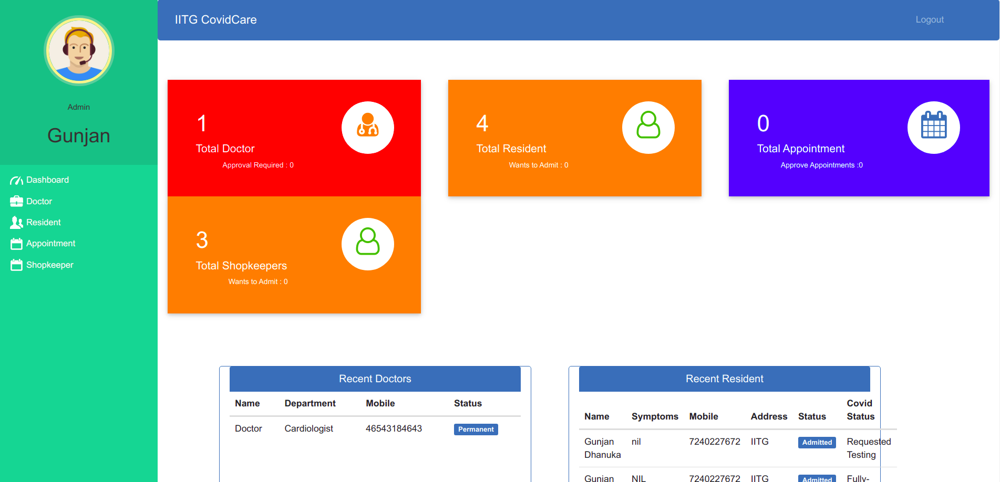
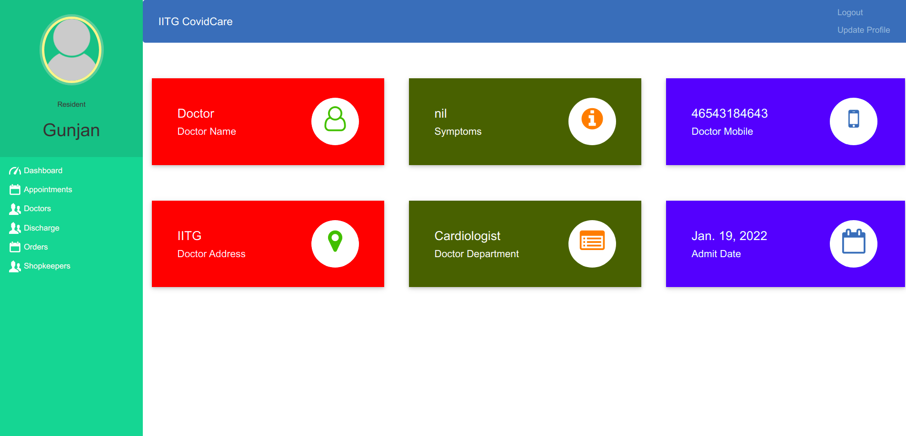
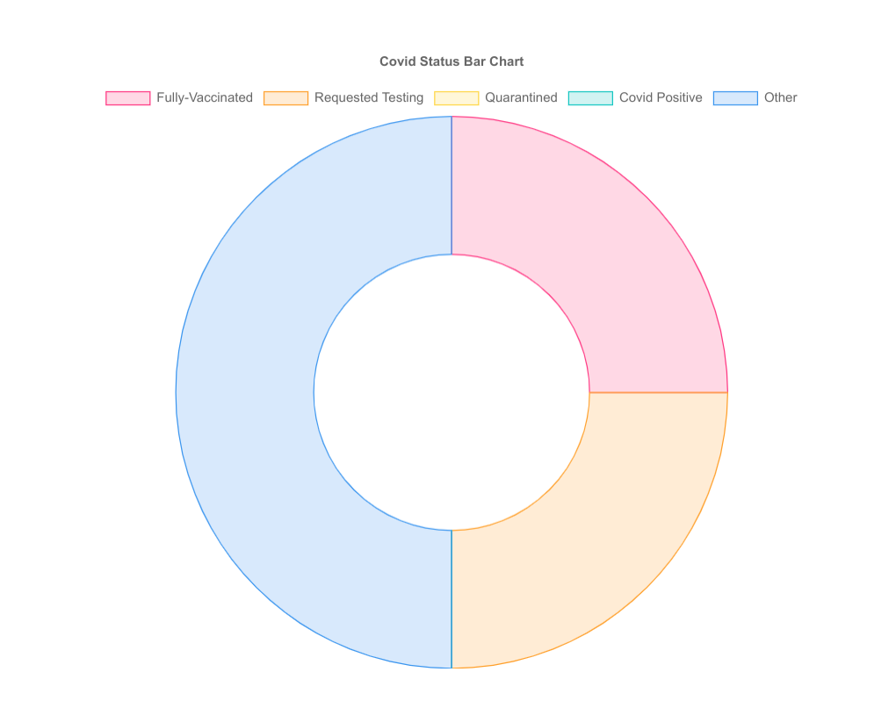

# IITG CovidCare
### Created by [Gunjan Dhanuka](https://github.com/GunjanDhanuka) and [Pranjal Singh](https://github.com/pranjal198)
---


## Screenshots
### Homepage

### Admin Dashboard

### Resident Dashboard


### Covid Statistic

---
## Functions
### Admin
- Signup their account. Then Login (No approval Required).
- Can register/view/approve/reject/delete doctor who are available for the Campus Junta.
- Can admit/view/approve/reject/discharge resident/student (discharge patient when treatment is done).
- Can Generate/Download Invoice pdf (Generate Invoice according to medicine cost, room charge, doctor charge and other charge).
- Can view/book/approve Appointment (approve those appointments which is requested by patient).
- Can register/view/approve/reject Shopkeepers (but order amount is hidden from admin).

### Doctor
- Apply on the CovidCare portal. Then Login (Approval required by portal admin, Then only doctor can login).
- Can only view their patient details (symptoms, name, mobile ) assigned to that doctor by admin.
- Can view their discharged(by admin) patient list.
- Can view their Appointments, booked by admin.
- Can delete their Appointment, when doctor attended their appointment.

### Shopkeeper
- Apply on the CovidCare portal. Then Login (Approval required by portal admin, Then only shopkeeper can login).
- Can receive orders from different patients and view their contacts and address.
- Can view their orders and contact the customer incase of any ambiguity.
- Can delete the Order, after they have finished delivering the order.

### Student/ Resident
- Create account in the portal. Then Login. No approval from admin required.
- Can view assigned doctor's details like ( specialization, mobile, address).
- Can view their booked appointment status (pending/confirmed by admin).
- Can book appointments.(approval required by admin)
- Can set their Covid Status (Vaccinated, Quarantined, Requested Testing, etc.)
- Can update their Covid Status when infected or recovered.
- Can make orders to the Shopkeepers whose list they can view.
- Can contact shopkeeper using the phone number incase of any doubts.
---

## HOW TO RUN THIS PROJECT
- Install Python(3.7.6) (Dont Forget to Tick Add to Path while installing Python)

- Download This Project Zip Folder and Extract it
- Move to project folder in Terminal. Then run following Commands :
```
pip install -r requirements.txt
py manage.py makemigrations
py manage.py migrate
py manage.py runserver
```
- Now enter following URL in Your Browser Installed On Your Pc
```
http://127.0.0.1:8000/
```

## CHANGES REQUIRED FOR CONTACT US PAGE
- In settings.py file, You have to give your email and password
```
EMAIL_HOST_USER = 'youremail@gmail.com'
EMAIL_HOST_PASSWORD = 'your email password'
EMAIL_RECEIVING_USER = 'youremail@gmail.com'
```
- Login to Gmail through host email id in your browser and open following link and turn it ON:
```
https://myaccount.google.com/lesssecureapps
```

